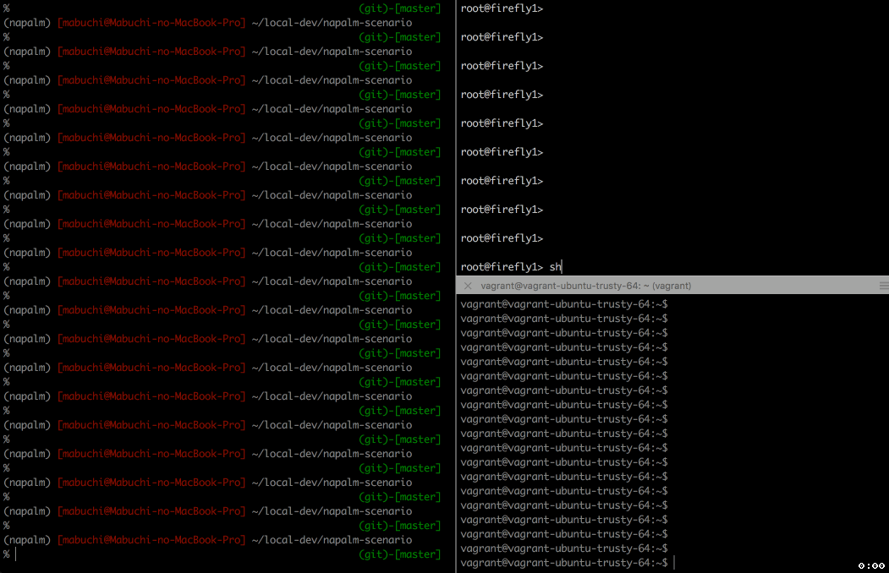

# NAPALM-scenario 
Scenario based Network Operation Tool for multi-vendor routers using NAPALM library.

# Demo
demo: configuring interface and BGP neighbor setting
 - Left : napalm-scenario tool
 - Right top : target router
 - Right bottom : bgp neighbor(already configured)



 - Note:
    - GREEN : success statement
    - RED   : faild statement
    - YELLOW: User determination statement (example: commit or discard, candidate config, validate result)

# How to run

```
python run_scenario.py -f <scenario file>
```

## Sccenarip Sample file

```
purpus: this is sample operation.
operator: Toshiya Mabuchi
operation_date: 20170621
hosts:
  management_ipaddress: 10.10.10.1
  hostname: sample1
  os : iosxr
  username: user1
  password: password1
scenario:
  - validate:
      - facts:
          version: 6.1.1
          hostname: iosxrv1
      - bgp_neighbor:
        - neighbor_address: 192.168.100.1
          ip_protocol: 4
          advertise_prefixes: 0
  - set_add_interface_ipv4:
      interface_name: GigabitEthernet0/0/0/1
      interface_address: 192.168.100.2
      interface_subnet: 30
      interface_description: Sample Interface
  - set_add_bgp_policy_ipv4:
      policy_name_out: peer-out
      prefix_name_out: aggregate-prefix
      advertised_route_address: 10.10.10.0
      advertised_route_subnet: 24
  - set_add_bgp_neighbor_ipv4:
      local_asnum : 65001
      neighbor_asnum : 65002
      neighbor: 192.168.100.1
      neighbor_description: AS65002_peer
      policy_name_out: peer-out
      policy_name_in: accept
```

# Additional config and validate template
Template file is put `./set_templates` and `./validate_templates`.
You can put new template files.
```
protocols {
    bgp {
        group {{ interface_name }} {
            family inet {
                unicast;
            }
            type external;
            neighbor {{ neighbor }} {
                description {{ neighbor_description }};
                peer-as {{ neighbor_asnum }};
                export {{ policy_name_out }};
                import {{ policy_name_in }};
            }
        }
    }
}
```